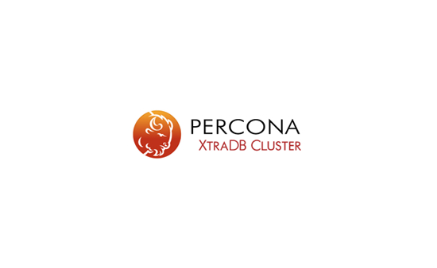

#Percona XtraDB Cluster

For more information about the Percona XtraDB Cluster components and how to use this product, see [Percona XtraDB Cluster documentation](https://www.percona.com/doc/percona-xtradb-cluster)

## Installation

You can install Percona XtraDB Cluster using the following methods:
- from the Percona repository 
- Build from the [source code](https://github.com/percona/percona-xtradb-cluster)

The installation instructions in the official documentation are [here](https://www.percona.com/doc/percona-xtradb-cluster/LATEST/install/index.html).

## Release Notes

The Release Notes are located [here](https://www.percona.com/doc/percona-xtradb-cluster/LATEST/release-notes/release-notes_index.html)

The Release Announcements are available [here](https://forums.percona.com/c/percona-news/software-new-releases/)

## Submit a bug report or a feature request

If you find a bug in Percona XtraDB Cluster, you can submit a report to the project's [Jira issue tracker](https://jira.percona.com/projects/PXC/issues)

As a general rule of thumb, please try to create a bug report that is:

- Reproducible - include the steps on how to reproduce the issue
- Specific - include as much detail as possible, such as which version, which environment, etc.
- Unique - do not duplicate existing tickets
- Scoped to a single issue - only one issue per report

## Licensing

Percona is dedicated to **keeping open source open**. Whenever possible, we strive to include permissive licensing for both our software and documentation. For this project, we are using version 2 of the GNU General Public License (GPLv2).

## How to get involved

We encourage contributions and are always looking for new members that are as dedicated to serving the community as we are. The [Contributing Guide](https://github.com/percona/percona-xtradb-cluster/blob/8.0/doc/source/contributing.md) contains how you can contribute.

## Contact
You can reach us by using the [Forum](https://forums.percona.com/c/mysql-mariadb/percona-xtradb-cluster-8-x/)

Copyright (c) 2000, 2021, Oracle and/or its affiliates.
