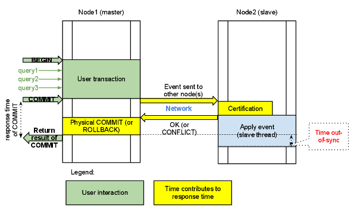

Multi-Master replication
========================

Multi-Master replication stands for the ability to write to any node in the cluster, and not to worry that eventually it will get out-of-sync situation, as it regularly happens with regular MySQL replication if you imprudently write to the wrong server.
This is a long-waited feature and there has been growing demand for it for the last two years, or even more.

With |Percona XtraDB Cluster| you can write to any node, and the Cluster guarantees consistency of writes. That is, the write is either committed on all the nodes or not committed at all.
For the simplicity, this diagram shows the use of the two-node example, but the same logic is applied with the N nodes:

All queries are executed locally on the node, and there is a special handling only on *COMMIT*. When the *COMMIT* is issued, the transaction has to pass certification on all the nodes. If it does not pass, you
will receive *ERROR* as a response on that query. After that, transaction is applied on the local node.

Response time of *COMMIT* consists of several parts:
 * Network round-trip time,
 * Certification time,
 * Local applying

Please note that applying the transaction on remote nodes does not affect the response time of *COMMIT*,
as it happens in the background after the response on certification.

The two important consequences of this architecture:
 * First: we can have several appliers working in parallel. This gives us a true parallel replication. Slave can have many parallel threads, and this can be tuned by variable :option:`wsrep_slave_threads`.
 * Second: There might be a small period of time when the slave is out-of-sync from master. This happens because the master may apply event faster than a slave. And if you do read from the slave, you may read the data that has not changed yet. You can see that from the diagram. However, this behavior can be changed by using variable :option:`wsrep_causal_reads=ON`. In this case, the read on the slave will wait until event is applied (this however will increase the response time of the read). This gap between the slave and the master is the reason why this replication is called "virtually synchronous replication", and not real "synchronous replication".

The described behavior of *COMMIT* also has the second serious implication. If you run write transactions to two different nodes, the cluster will use an `optimistic locking model <http://en.wikipedia.org/wiki/Optimistic_concurrency_control>`_. That means a transaction will not check on possible locking conflicts during the individual queries, but rather on the *COMMIT* stage, and you may get *ERROR* response on *COMMIT*. This is mentioned because it is one of the incompatibilities with regular |InnoDB| that you might experience. In InnoDB usually *DEADLOCK* and *LOCK TIMEOUT* errors happen in response on particular query, but not on *COMMIT*. It's good practice to check the error codes after *COMMIT* query, but there are still many applications that do not do that.

If you plan to use Multi-Master capabilities of |XtraDB Cluster| and run write transactions on several nodes, you may need to make sure you handle response on *COMMIT* query.
