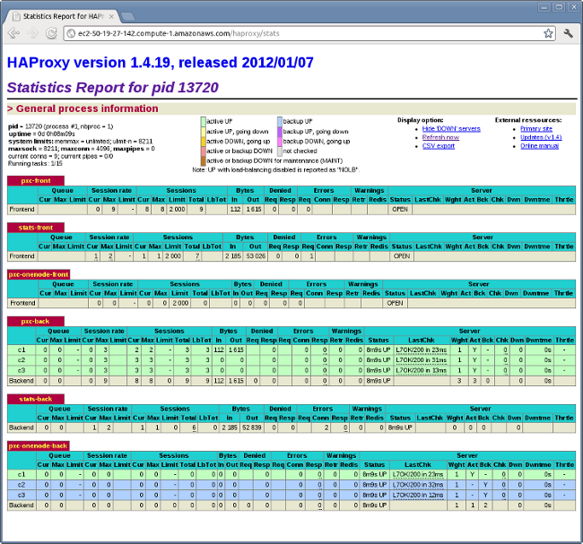

.. _sandbox:

==================================================
Setting up PXC reference architecture with HAProxy
==================================================

This manual describes how to set up |PXC| in a virtualized test sandbox.

The procedure assumes Amazon EC2 micro instances running CentOS 6.
However, it should apply to any virtualization technology
(for example, VirtualBox) with any Linux distribution.

This manual requires three virtual machines for |PXC| nodes,
and one for HAProxy client, which redirects requests to the nodes.
Running HAProxy on an application server,
instead of having it as a dedicated entity,
removes the unnecessary extra network roundtrip,
because the load balancing layer in |PXC| scales well
with application servers.

1. Install |PXC| on the three cluster nodes, as described in :ref:`yum`.

#. Install HAProxy and ``sysbench`` on the client node:

   .. code-block:: bash

      yum -y install haproxy sysbench

#. Make sure that the :file:`my.cnf` configuration file on the first node
   contains the following::

      [mysqld]
      server_id=1
      binlog_format=ROW
      log_bin=mysql-bin
      wsrep_cluster_address=gcomm://
      wsrep_provider=/usr/lib/libgalera_smm.so
      datadir=/var/lib/mysql

      wsrep_slave_threads=2
      wsrep_cluster_name=pxctest
      wsrep_sst_method=xtrabackup
      wsrep_node_name=ip-10-112-39-98

      log_slave_updates

      innodb_autoinc_lock_mode=2
      innodb_buffer_pool_size=400M
      innodb_log_file_size=64M

#. Start the first node

#. Adjust the :file:`my.cnf` configuration files
   on the second and third nodes to contain the same configuration settings,
   except the following:

   * Second node::

        server_id=2
        wsrep_cluster_address=gcomm://10.116.39.76
        wsrep_node_name=ip-10-244-33-92

   * Third node::

        server_id=3
        wsrep_cluster_address=gcomm://10.116.39.76
        wsrep_node_name=ip-10-194-10-179

   .. note::

      * ``server_id`` can be any unique number
      * ``wsrep_cluster_address`` is the IP address of the first node
      * ``wsrep_node_name`` can be any unique name, for example,
        the output of the ``hostname`` command

#. Start the second and third nodes.

   When a new node joins the cluster,
   |SST| is performed by taking a backup using XtraBackup,
   then copying it to the new node with ``netcat``.
   After a successful |SST|, you should see the following in the error log::

      120619 13:20:17 [Note] WSREP: State transfer required:
           Group state: 77c9da88-b965-11e1-0800-ea53b7b12451:97
           Local state: 00000000-0000-0000-0000-000000000000:-1
      120619 13:20:17 [Note] WSREP: New cluster view: global state: 77c9da88-b965-11e1-0800-ea53b7b12451:97, view# 18: Primary, number of nodes: 3, my index: 0, protocol version 2
      120619 13:20:17 [Warning] WSREP: Gap in state sequence. Need state transfer.
      120619 13:20:19 [Note] WSREP: Running: 'wsrep_sst_xtrabackup 'joiner' '10.195.206.117' '' '/var/lib/mysql/' '/etc/my.cnf' '20758' 2>sst.err'
      120619 13:20:19 [Note] WSREP: Prepared |SST| request: xtrabackup|10.195.206.117:4444/xtrabackup_sst
      120619 13:20:19 [Note] WSREP: wsrep_notify_cmd is not defined, skipping notification.
      120619 13:20:19 [Note] WSREP: Assign initial position for certification: 97, protocol version: 2
      120619 13:20:19 [Warning] WSREP: Failed to prepare for incremental state transfer: Local state UUID (00000000-0000-0000-0000-000000000000) does not match group state UUID (77c9da88-b965-11e1-0800-ea53b7b12451): 1 (Operation not permitted)
            at galera/src/replicator_str.cpp:prepare_for_IST():439. IST will be unavailable.
      120619 13:20:19 [Note] WSREP: Node 0 (ip-10-244-33-92) requested state transfer from '*any*'. Selected 1 (ip-10-112-39-98)(SYNCED) as donor.
      120619 13:20:19 [Note] WSREP: Shifting PRIMARY -> JOINER (TO: 102)
      120619 13:20:19 [Note] WSREP: Requesting state transfer: success, donor: 1
      120619 13:20:59 [Note] WSREP: 1 (ip-10-112-39-98): State transfer to 0 (ip-10-244-33-92) complete.
      120619 13:20:59 [Note] WSREP: Member 1 (ip-10-112-39-98) synced with group.
      120619 13:21:17 [Note] WSREP: |SST| complete, seqno: 105
      120619 13:21:17 [Note] Plugin 'FEDERATED' is disabled.
      120619 13:21:17 InnoDB: The InnoDB memory heap is disabled
      120619 13:21:17 InnoDB: Mutexes and rw_locks use GCC atomic builtins
      120619 13:21:17 InnoDB: Compressed tables use zlib 1.2.3
      120619 13:21:17 InnoDB: Using Linux native AIO
      120619 13:21:17 InnoDB: Initializing buffer pool, size = 400.0M
      120619 13:21:17 InnoDB: Completed initialization of buffer pool
      120619 13:21:18 InnoDB: highest supported file format is Barracuda.
      120619 13:21:18  InnoDB: Waiting for the background threads to start
      120619 13:21:19 Percona XtraDB (http://www.percona.com) 1.1.8-rel25.3 started; log sequence number 246661644
      120619 13:21:19 [Note] Recovering after a crash using mysql-bin
      120619 13:21:19 [Note] Starting crash recovery...
      120619 13:21:19 [Note] Crash recovery finished.
      120619 13:21:19 [Note] Server hostname (bind-address): '(null)'; port: 3306
      120619 13:21:19 [Note]   - '(null)' resolves to '0.0.0.0';
      120619 13:21:19 [Note]   - '(null)' resolves to '::';
      120619 13:21:19 [Note] Server socket created on IP: '0.0.0.0'.
      120619 13:21:19 [Note] Event Scheduler: Loaded 0 events
      120619 13:21:19 [Note] WSREP: Signalling provider to continue.
      120619 13:21:19 [Note] WSREP: Received |SST|: 77c9da88-b965-11e1-0800-ea53b7b12451:105
      120619 13:21:19 [Note] WSREP: |SST| received: 77c9da88-b965-11e1-0800-ea53b7b12451:105
      120619 13:21:19 [Note] WSREP: 0 (ip-10-244-33-92): State transfer from 1 (ip-10-112-39-98) complete.
      120619 13:21:19 [Note] WSREP: Shifting JOINER -> JOINED (TO: 105)
      120619 13:21:19 [Note] /usr/sbin/mysqld: ready for connections.
      Version: '5.5.24-log'  socket: '/var/lib/mysql/mysql.sock'  port: 3306  Percona XtraDB Cluster (GPL), wsrep_23.6.r340
      120619 13:21:19 [Note] WSREP: Member 0 (ip-10-244-33-92) synced with group.
      120619 13:21:19 [Note] WSREP: Shifting JOINED -> SYNCED (TO: 105)
      120619 13:21:20 [Note] WSREP: Synchronized with group, ready for connections

   For debugging information about the |SST|,
   you can check the :file:`sst.err` file and the error log.

   After |SST| finishes, you can check the cluster size as follows:

   .. code-block:: mysql

      mysql> show global status like 'wsrep_cluster_size';
      +--------------------+-------+
      | Variable_name      | Value |
      +--------------------+-------+
      | wsrep_cluster_size | 3     |
      +--------------------+-------+
      1 row in set (0.00 sec)

#. When all cluster nodes are started, configure HAProxy on the client node.
   This will enable the application to connect to localhost
   as if it were a single MySQL server, instead of a |PXC| node.

   You can configure HAProxy to connect and write to all cluster nodes
   or to one node at a time.
   The former method can lead to rollbacks due to conflicting writes
   when optimistic locking at commit time is triggered,
   while the latter method avoids rollbacks.

   However, most good applications should be able to handle rollbacks,
   so either method is fine in this case.

   To configure HAProxy, add the following to :file:`/etc/haproxy/haproxy.cfg`::

      global
      log 127.0.0.1 local0
      log 127.0.0.1 local1 notice
      maxconn 4096
      chroot /usr/share/haproxy
      user haproxy
      group haproxy
      daemon

      defaults
      log global
      mode http
      option tcplog
      option dontlognull
      retries 3
      option redispatch
      maxconn 2000
      contimeout 5000
      clitimeout 50000
      srvtimeout 50000

      frontend pxc-front
      bind *:3307
      mode tcp
      default_backend pxc-back

      frontend stats-front
      bind *:80
      mode http
      default_backend stats-back

      frontend pxc-onenode-front
      bind *:3306
      mode tcp
      default_backend pxc-onenode-back

      backend pxc-back
      mode tcp
      balance leastconn
      option httpchk
      server c1 10.116.39.76:3306 check port 9200 inter 12000 rise 3 fall 3
      server c2 10.195.206.117:3306 check port 9200 inter 12000 rise 3 fall 3
      server c3 10.202.23.92:3306 check port 9200 inter 12000 rise 3 fall 3

      backend stats-back
      mode http
      balance roundrobin
      stats uri /haproxy/stats
      stats auth pxcstats:secret

      backend pxc-onenode-back
      mode tcp
      balance leastconn
      option httpchk
      server c1 10.116.39.76:3306 check port 9200 inter 12000 rise 3 fall 3
      server c2 10.195.206.117:3306 check port 9200 inter 12000 rise 3 fall 3 backup
      server c3 10.202.23.92:3306 check port 9200 inter 12000 rise 3 fall 3 backup

   In this configuration, three frontend-backend pairs are defined:

   * The ``stats`` pair is for HAProxy statistics page (port 80).

     You can access it at ``/haproxy/stats`` using the credential
     specified in the ``stats auth`` parameter.

   * The ``pxc`` pair is for connecting to all three nodes (port 3307).

     In this case, the *leastconn* load balancing method is used,
     instead of round-robin, which means connection is made to the backend
     with the least connections established.

   * The ``pxc-onenode`` pair is for connecting to one node at a time
     (port 3306) to avoid rollbacks because of optimistic locking.

     If the node goes offline, HAProxy will connect to another one.

   .. note:: MySQL is checked via ``httpchk``.
      MySQL will not serve these requests by default.
      You have to set up the ``clustercheck`` utility,
      which is distributed with |PXC|.
      This will enable HAProxy to check MySQL via HTTP.

      The ``clustercheck`` script is a simple shell script
      that accepts HTTP requests
      and checks the node via the :option:`wsrep_local_state` variable.
      If the node's status is fine,
      it will send a response with HTTP code ``200 OK``.
      Otherwise, it sends ``503``.

      To create the ``clustercheck`` user, run the following:

      .. code-block:: mysql

         mysql> grant process on *.* to 'clustercheckuser'@'localhost' identified by 'clustercheckpassword!';
         Query OK, 0 rows affected (0.00 sec)

         mysql> flush privileges;
         Query OK, 0 rows affected (0.00 sec)

      If you want to use a different user name or password,
      you have to modify them in the ``clustercheck`` script.

      If you run the script on a running node, you should see the following::

         # clustercheck
         HTTP/1.1 200 OK

         Content-Type: Content-Type: text/plain

      You can use ``xinetd`` to daemonize the script.
      If `xinetd` is not installed, you can install it with ``yum``::

         # yum -y install xinetd

      The service is configured in :file:`/etc/xinetd.d/mysqlchk`::

         # default: on
         # description: mysqlchk
         service mysqlchk
         {
         # this is a config for xinetd, place it in /etc/xinetd.d/
         disable = no
         flags = REUSE
         socket_type = stream
         port = 9200
         wait = no
         user = nobody
         server = /usr/bin/clustercheck
         log_on_failure += USERID
         only_from = 0.0.0.0/0
         # recommended to put the IPs that need
         # to connect exclusively (security purposes)
         per_source = UNLIMITED
         }

      Add the new service to :file:`/etc/services`::

         mysqlchk 9200/tcp # mysqlchk

      Clustercheck will now listen on port 9200 after ``xinetd`` restarts
      and HAProxy is ready to check MySQL via HTTP::

         # service xinetd restart

If you did everything correctly,
the statistics page for HAProxy should look like this:

Testing the cluster with sysbench
=================================

After you set up |PXC| in a sand box, you can test it using
`sysbench <https://launchpad.net/sysbench/>`_.
This example shows how to do it with ``sysbench`` from the EPEL repository.

1. Create a database and a user for ``sysbench``:

   .. code-block:: mysql

      mysql> create database sbtest;
      Query OK, 1 row affected (0.01 sec)

      mysql> grant all on sbtest.* to 'sbtest'@'%' identified by 'sbpass';
      Query OK, 0 rows affected (0.00 sec)

      mysql> flush privileges;
      Query OK, 0 rows affected (0.00 sec)

#. Populate the table with data for the benchmark:

   .. code-block:: bash

      sysbench --test=oltp --db-driver=mysql --mysql-engine-trx=yes --mysql-table-engine=innodb --mysql-host=127.0.0.1 --mysql-port=3307 --mysql-user=sbtest --mysql-password=sbpass --oltp-table-size=10000 prepare

3. Run the benchmark on port 3307:

   .. code-block:: bash

      sysbench --test=oltp --db-driver=mysql --mysql-engine-trx=yes --mysql-table-engine=innodb --mysql-host=127.0.0.1 --mysql-port=3307 --mysql-user=sbtest --mysql-password=sbpass --oltp-table-size=10000 --num-threads=8 run

   You should see the following in HAProxy statistics for ``pxc-back``:

   .. image:: ../_static/pxc_haproxy_lb_leastconn.png

   Note the ``Cur`` column under ``Session``:

   * ``c1`` has 2 threads connected
   * ``c2`` and ``c3`` have 3 threads connected

4. Run the same benchmark on port 3306:

   .. code-block:: bash

      sysbench --test=oltp --db-driver=mysql --mysql-engine-trx=yes --mysql-table-engine=innodb --mysql-host=127.0.0.1 --mysql-port=3306 --mysql-user=sbtest --mysql-password=sbpass --oltp-table-size=10000 --num-threads=8 run

   You should see the following in HAProxy statistics for ``pxc-onenode-back``:

   .. image:: ../_static/pxc_haproxy_lb_active_backup.png

   All 8 threads are connected to the ``c1`` server.
   ``c2`` and ``c3`` are acting as backup nodes.

If you are using |HAProxy| for |MySQL| you can break the privilege system’s
host part, because |MySQL| will think that the connections are always coming
from the load balancer. You can work this around using T-Proxy patches and some
`iptables` magic for the backwards connections. However in the setup described
in this how-to this is not an issue, since each application server has it's own
|HAProxy| instance, each application server connects to 127.0.0.1, so MySQL
will see that connections are coming from the application servers. Just like in
the normal case.
